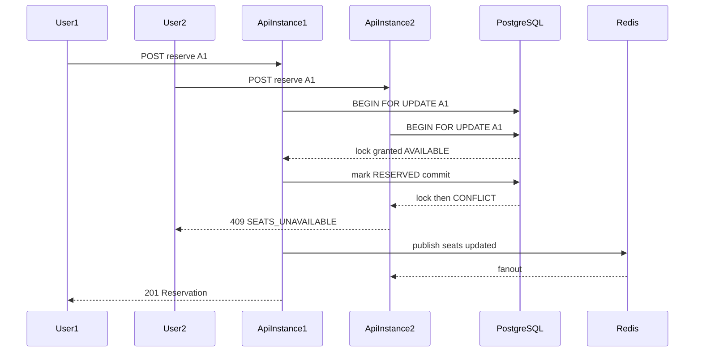

# Real-Time Cinema Seat Reservation System

Full-stack assessment project: **TypeScript · Next.js · Fastify · PostgreSQL · Redis · Socket.IO**.

The system guarantees a seat is never double-booked under high concurrency and across multiple API instances behind a load balancer. Frontend booking and the third-party partner API share one `ReservationService`.

## Stack

| Layer | Choice |
|-------|--------|
| Web | Next.js App Router, light/dark theme |
| API | Fastify + Prisma |
| DB | PostgreSQL (`SELECT … FOR UPDATE`) |
| Realtime | Socket.IO + Redis adapter |
| Auth | JWT + RBAC (`USER` / `ADMIN`) |

## Monorepo layout

```
apps/api          Fastify API (modules, plugins, workers)
apps/web          Next.js UI (ui kit, layout, features)
packages/shared   Types, zod schemas, pagination, constants
scripts/          Concurrency simulation CLI
docker/           nginx load balancer config
```

## Quick start (local)

### Prerequisites

- Node 20+
- Docker (Postgres + Redis)

```bash
# 1) Infrastructure
docker compose up -d postgres redis

# 2) Env
cp .env.example .env

# 3) Install & DB
npm install
npm run build -w @cinema/shared
npm run db:generate -w @cinema/api
cd apps/api && npx prisma migrate deploy && npx tsx prisma/seed.ts && cd ../..

# 4) Run
npm run dev:api
npm run dev:web
```

- Web: http://localhost:3000  
- API: http://localhost:4001  

> Default local ports use **5433** (Postgres), **6380** (Redis), and **4001** (API) to avoid clashing with other Docker stacks.

**Demo accounts**

| Email | Password | Role |
|-------|----------|------|
| `user@cinema.local` | `User1234!` | USER |
| `admin@cinema.local` | `Admin123!` | ADMIN |

Partner API key (header `x-api-key`): `partner-dev-key-change-me`

## Docker (multi-instance)

```bash
docker compose up --build
```

- Web (compose): http://localhost:3001 (API via nginx at http://localhost:8080)
- Local web (dev): http://localhost:3000 → API http://localhost:4001
- nginx round-robins `api1` + `api2`

## Architecture decisions

### Correctness under concurrency

All mutations go through `ReservationService.reserve()` / `cancel()` / `expireDue()`:

1. Transaction opens
2. Requested seats locked with `SELECT … FOR UPDATE` (ordered by id → no deadlocks)
3. Status checked (`AVAILABLE`)
4. Seats marked `RESERVED`, reservation row created with `expiresAt`
5. Commit → activity log → `seats:updated` emit

Postgres is the source of truth. Application-level locks would fail across instances.

### Horizontal scale + realtime

- Multiple Fastify instances share Postgres
- Socket.IO Redis adapter fans out seat updates across instances
- **Degraded mode:** if Redis is down, bookings still succeed; cross-instance live updates may lag (clients can refresh `GET /api/seats`)

### Shared booking logic

| Entry | Auth | Source |
|-------|------|--------|
| `POST /api/reservations` | JWT | `FRONTEND` |
| `POST /api/v1/partner/reservations` | `x-api-key` | `PARTNER` |
| Admin cancel / simulation | JWT ADMIN | uses same service |

### Contention flow



### Rejected alternatives

- **SQLite** — weak multi-writer / multi-instance story
- **Sticky sessions** — hides the distribution problem; we use Redis pub/sub instead
- **Queue for reserve** — wrong tool for sync seat claims; would add latency without helping correctness

## Features

- Real-time seat map (Socket.IO)
- Auth + admin RBAC
- Activity logs (filter + pagination)
- Reservation TTL (default 5 minutes) + cancel
- Optimistic UI + client retry (no retry on `409`)
- Admin concurrency simulation (100 users, mixed frontend/partner)
- Light / dark theme
- Structured logs with `x-request-id`

## API overview

- `POST /api/auth/register|login`
- `GET /api/seats`, `/api/seats/all`, `/api/seats/availability`
- `POST /api/reservations` · `GET /api/me/reservations` · `DELETE /api/reservations/:id`
- `GET /api/me/activity-logs`
- `POST /api/v1/partner/reservations`
- Admin: `/api/admin/activity-logs|reservations|users|metrics|simulate/concurrency|seats/reset`

List endpoints share `{ data, meta }` pagination (`page`, `pageSize`, `sortBy`, `sortOrder` + resource filters).

## Partner / third-party integration API

External booking partners do **not** use JWT. They call a dedicated API that shares the same seat-locking service as the frontend, so partner and web traffic cannot double-book the same seat.

### Base URL

| Environment | Base |
|-------------|------|
| Local API | `http://localhost:4001` |
| Docker (nginx LB) | `http://localhost:8080` |

### Authentication

Send the partner key on every request:

```http
x-api-key: <PARTNER_API_KEY>
```

Configure the key via env `PARTNER_API_KEY` (see `.env.example`). Invalid or missing keys return `401`.

### Discover seats (public)

Partners need seat IDs (cuid) before booking. These endpoints are public:

```http
GET /api/seats/all
GET /api/seats/availability
GET /api/seats?page=1&pageSize=50&status=AVAILABLE
```

Example seat payload:

```json
{
  "id": "clx…",
  "label": "A1",
  "status": "AVAILABLE",
  "updatedAt": "2026-07-23T12:00:00.000Z"
}
```

### Create a reservation

```http
POST /api/v1/partner/reservations
Content-Type: application/json
x-api-key: partner-dev-key-change-me
```

**Body**

| Field | Type | Required | Notes |
|-------|------|----------|--------|
| `seatIds` | `string[]` | yes | 1–50 seat IDs; duplicates ignored |
| `userId` | `string` | no | Existing user id. If omitted, bookings are attributed to `partner@cinema.local` |

**Success — `201`**

```json
{
  "id": "clx…",
  "userId": "clx…",
  "userEmail": "partner@cinema.local",
  "source": "PARTNER",
  "status": "ACTIVE",
  "seatIds": ["clx…"],
  "seatLabels": ["A1"],
  "createdAt": "2026-07-23T12:00:00.000Z",
  "expiresAt": "2026-07-23T12:05:00.000Z"
}
```

Reservations expire after `RESERVATION_TTL_MS` (default **5 minutes**) unless cancelled by an authenticated user/admin.

**Errors**

| Status | Code | When |
|--------|------|------|
| `401` | `UNAUTHORIZED` | Missing/invalid `x-api-key` |
| `404` | `NOT_FOUND` | Unknown seat id |
| `409` | `SEATS_UNAVAILABLE` | Seat already reserved (incl. concurrent race lost) |
| `400` | validation | Empty `seatIds` or schema failure |

`409` body includes unavailable seat ids so the partner can retry **other** seats (do not blindly retry the same ids).

### curl examples

Reserve one seat:

```bash
# 1) List seats and copy an AVAILABLE id
curl -s http://localhost:4001/api/seats/all | jq '.data[] | select(.status=="AVAILABLE") | {id,label}' | head

# 2) Book it
curl -X POST http://localhost:4001/api/v1/partner/reservations \
  -H "content-type: application/json" \
  -H "x-api-key: partner-dev-key-change-me" \
  -d "{\"seatIds\":[\"<seat-cuid>\"]}"
```

Via Docker load balancer:

```bash
curl -X POST http://localhost:8080/api/v1/partner/reservations \
  -H "content-type: application/json" \
  -H "x-api-key: partner-dev-key-change-me" \
  -d "{\"seatIds\":[\"<seat-cuid>\"]}"
```

### How it relates to the frontend API

| | Frontend | Partner |
|---|---|---|
| Path | `POST /api/reservations` | `POST /api/v1/partner/reservations` |
| Auth | `Authorization: Bearer <jwt>` | `x-api-key` |
| `source` stored | `FRONTEND` | `PARTNER` |
| Locking / TTL / sockets | Same `ReservationService` | Same `ReservationService` |

Successful partner bookings emit `seats:updated` over Socket.IO, so open UIs refresh in real time.

### What partners cannot do (by design)

Partner key only creates reservations. Listing/cancelling for end users stays on JWT routes (`/api/me/*`, `/api/reservations/:id`, admin APIs).

## Concurrency simulation

```bash
# Against local API
npm run simulate

# Or as admin in UI: Simulation page
```

Expect: `duplicateSeatViolations === 0`.

## Tests

```bash
npm test -w @cinema/api
```

Includes pagination unit tests, health smoke test, and a concurrent reservation integration test (requires Postgres; set `SKIP_DB_TESTS=1` to skip).

## How to verify

Automated (against a running API):

```bash
npm run verify
```

Manual checklist:

- [ ] `docker compose up --build` — postgres, redis, api1, api2, nginx, web healthy
- [ ] Login as user; two browsers; reserve different seats — both update live
- [ ] Both select same seat — one `409`; UIs converge
- [ ] Partner `curl` with `x-api-key` reserves; UI updates
- [ ] Admin runs simulation — no double-booked seats
- [ ] Cancel / wait TTL — seats become AVAILABLE + activity logs
- [ ] Stop Redis briefly — HTTP reserve still works
- [ ] USER cannot call `/api/admin/*` (403)
- [ ] Filters persist in the URL (refresh keeps status/search/page)
- [ ] Active reservations show a live expiry countdown

## Trade-offs

- Expire worker uses Redis lock when available; falls back to idempotent DB updates if Redis is down (possible duplicate expire attempts, still safe).
- Optimistic UI improves perceived speed; socket payload remains the multi-user source of truth.
- UI polish follows `design.png` shell patterns without overbuilding ecommerce chrome.
